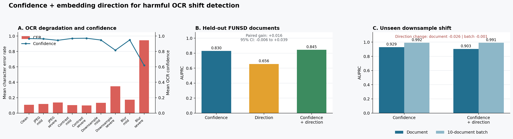

# OCR Quality Monitor: Review Prioritization with Text Embeddings

[한국어](README.md)

This project studies which OCR documents to review before ingesting regulatory PDFs into a RAG knowledge base, when new ground-truth transcripts are unavailable. The initial idea was to compare each document's text embedding with previously accepted documents and use the distance to prioritize review.

Confidence was a strong baseline. Embeddings added information for some character errors, but missed plausible substitutions such as one valid price being replaced by another. The result is a clearer account of which failures logs can reveal, alongside a small CLI for reviewing text anomalies.

## Intended use

The intended review stage sits between OCR and RAG/KB ingestion so that misread numbers or clauses can be checked before becoming retrieval evidence. This is an assumed use case, not a deployed regulatory service. FUNSD forms and CORD receipts provide public, labeled test data rather than a reproduction of regulatory documents.

The monitor can use output text, confidence metadata and accepted reference logs, without model weights or character logits. Risk ranking could direct limited review time toward suspicious records. Review-time savings have not been measured.

The public implementation accepts text JSONL, compares it with an accepted reference, and exports review recommendations. It does not correct OCR text or certify that a value is correct.

## Idea and evaluation

The hypothesis was that corrupted OCR output would move away from normal text in embedding space. I separated document degradation, local character mismatch and critical-field errors because a wrong price can leave the meaning of a receipt almost unchanged.

The idea extends my work on answer-embedding changes in RAG to OCR text. Individual-document novelty was the starting point; batch centroid, MMD and neighbor-distance summaries were added as supplementary observations. Image corruptions stress-test different input conditions rather than replicate a production error distribution.

The experiments used fixed RapidOCR settings and `BAAI/bge-m3` embeddings, with cosine kNN `k=5` for the principal clean-reference comparison. FUNSD contains 149 reference/training documents and 50 test documents across nine conditions; CORD v2 uses 100 training and 100 test receipts across six conditions. The totals, 1,791 and 1,200 document-condition records, include training/reference documents.

There are two evaluation settings. Clean-reference ECDF scores use accepted logs without error-label training. Logistic regression comparisons use historical training-document error labels to test whether embedding features add information to confidence. Both can score new documents without their ground truth, but the logistic comparisons are not label-free training.

## Findings

| Evaluation | Confidence AUPRC | Confidence + embedding AUPRC | Interpretation |
|---|---:|---:|---|
| FUNSD document harm | 0.8295 | 0.8454 | Gain 0.0159; paired 95% CI [-0.0062, 0.0388] does not confirm an overall improvement |
| CORD alphabetic component mismatch | 0.5907 | 0.6904 | Complementary signal for this local character-error target |

These rows are supervised diagnostic comparisons with different labels and evaluation units. AUPRC measures how well a score ranks errors and is not a percentage of documents correctly classified.



On unseen downsampling, the FUNSD document AUPRC decreased from 0.9291 to 0.9035 after adding direction features. The result does not support a general claim that embeddings improve document-level harm detection.

Auxiliary CORD analysis separated newly omitted and substituted `total`/`subtotal` values. A clean-calibrated mean of confidence, coverage and numeric-output risk improved omission AUPRC from 0.5638 to 0.6679; the bootstrap mean gain was 0.1132 with 95% CI [0.0127, 0.2211]. It did not improve substitution detection. Coverage uses image ink regions and OCR boxes, so this is an auxiliary analysis beyond text-only input, not evidence for embedding fusion.

A separate text counterfactual altered 98 clean-correct critical values. Value-only embedding AUROC was 0.9716 for out-of-support substitutions and 0.4151 for valid-value swaps. This probes what embedding distance measures; it is not a benchmark of naturally occurring OCR errors.

[Result tables and provenance](results/README.md) · [Detailed experiment settings](docs/EXPERIMENT_CONTEXT.md)

## Run the public CLI

The CLI implements the embedding path only. It does not run OCR, synthesize image corruptions, train confidence fusion, or reproduce the benchmark above. An input confidence field is preserved as metadata but is not scored. Its record score uses the nearest reference neighbor, unlike the experiment's locked kNN `k=5` feature.

```powershell
python -m venv .venv
.\.venv\Scripts\Activate.ps1
python -m pip install -e ".[dev]"
ocr-embedding-monitor --baseline examples/baseline.jsonl --candidate examples/candidate_corrupted.jsonl --output-dir outputs/demo --backend hash
pytest
```

`outputs/demo/` contains a ranked `scored_records.jsonl`, a `summary.json` with centroid distance, MMD and neighbor-distance ratio, and a readable `report.md`. The hash backend uses character patterns for a deterministic smoke run. To compare semantic embeddings:

```powershell
python -m pip install -e ".[semantic]"
ocr-embedding-monitor --baseline examples/baseline.jsonl --candidate examples/candidate_corrupted.jsonl --output-dir outputs/semantic --backend sentence-transformers --device cpu
```

The first semantic run downloads `BAAI/bge-m3`. Source code is in [`src/ocr_embedding_monitor`](src/ocr_embedding_monitor/), fixtures in [`examples`](examples/), tests in [`tests`](tests/), and retained experiment aggregates in [`results`](results/).

## Limits

The experiments use one OCR engine and mostly synthetic degradation. A distribution change alone does not establish an OCR error. Important prices and dates still need field checks or human review, and operational thresholds need calibration to review capacity and error costs. Original datasets, case-level OCR outputs and the full benchmark harness are not included in this public CLI repository. [Further work](docs/LEARNING_ROADMAP.md) lists unimplemented evaluation and service extensions.
