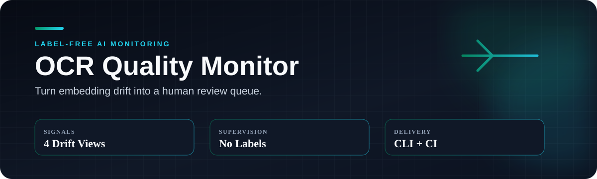
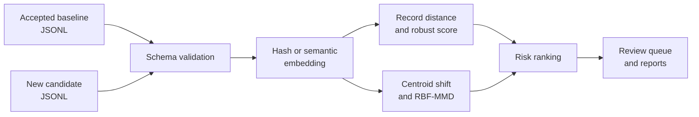

<div align="center">

**정답이 없는 OCR 환경에서 confidence와 embedding signal의 역할을 비교하고, 공개본에서는 embedding drift를 검수 순서로 연결한 프로젝트**


[연구에서 확인한 것](#연구에서-확인한-것) · [동작 구조](#동작-구조) · [빠른 실행](#빠른-실행) · [실험 맥락](docs/EXPERIMENT_CONTEXT.md)

</div>

---

## 운영 제약

새 OCR 문서가 들어온 직후에는 정답 transcription이 없어 CER이나 WER을 계산할 수 없는 경우가 많습니다. 라벨이 도착할 때까지 기다리면 새로운 양식, 언어, 촬영 조건과 손상 패턴을 뒤늦게 발견하게 됩니다. 모든 문서를 사람이 먼저 확인하는 방식도 처리량이 늘면 유지하기 어렵습니다.

## 질문

> Gold transcription이 아직 없는 상태에서, 기존 승인 데이터와 달라진 record와 batch를 찾아 검수 순서를 정할 수 있는가?

이 프로젝트는 OCR 오류를 자동 판정하려는 도구가 아닙니다. 승인된 baseline과 새 candidate를 비교해 제한된 검수 시간을 어디에 먼저 쓸지 정하는 risk signal을 만듭니다.

## 연구에서 확인한 것

원 연구에서는 FUNSD 199개 문서에 9개 조건을 적용한 1,791건과 CORD v2 200개 문서에 6개 조건을 적용한 1,200건을 사용했습니다. OCR confidence를 먼저 baseline으로 두고, sentence embedding 기반 novelty를 추가했을 때 어떤 오류에서 검수 순위가 좋아지는지 비교했습니다. Gold transcription은 detector 입력이 아니라 사후 평가에만 사용했습니다.

| 대표 조건 | Confidence AUPRC | 비교 조합 | 조합 AUPRC | 해석 |
|---|---:|---|---:|---|
| FUNSD 전체 degradation | 0.8295 | confidence + direction | 0.8454 | Confidence가 이미 강했고 추가 이득은 작았음 |
| CORD alphabetic mismatch | 0.5907 | confidence + kNN5 | 0.6904 | 이 조건에서는 kNN novelty가 보완 신호로 작동 |

Embedding 결합은 모든 조건에서 좋아지지 않았습니다. 문서 전체가 훼손된 경우와 숫자·단어 하나만 바뀐 local critical error는 서로 다른 탐지 문제였습니다. 전체 의미가 유지되면 embedding과 document-level confidence가 정상이어도 중요한 field 하나는 틀릴 수 있습니다.

위 표는 원 연구의 집계 결과입니다. 현재 공개 저장소는 원 corpus와 전체 inference pipeline을 포함하지 않고, embedding drift를 record·batch risk triage로 연결한 실행 가능한 공개본입니다. 데이터, 조건과 해석 범위는 [실험 맥락](docs/EXPERIMENT_CONTEXT.md)에 분리했습니다.

## 접근과 선택 이유

개별 record가 baseline에서 얼마나 떨어졌는지와 candidate batch 전체 분포가 얼마나 이동했는지를 분리했습니다. 두 신호를 review queue와 report로 내보내 사람이 record 단위 이상과 공급처·양식 단위 변화를 따로 확인할 수 있게 했습니다.

### 왜 embedding을 사용했는가

실제 배포 환경에서는 새 문서가 들어온 직후 비교할 정답 transcription이 없는 경우가 많습니다. Confidence는 유용한 baseline이지만 OCR model 자신의 확신만 보여줍니다. 결과 text가 정상 reference의 의미 공간에서 얼마나 벗어났는지는 별도 신호로 볼 필요가 있어, 승인된 baseline과 새 입력을 같은 embedding space에 놓고 거리를 비교했습니다.

Embedding distance가 크다고 OCR이 틀렸다는 뜻은 아닙니다. 정상적인 새 문서 유형도 멀리 떨어질 수 있습니다. 따라서 이 값은 자동 실패 판정에 쓰지 않고, 사람이 먼저 확인할 문서를 고르는 데만 사용합니다.

### 왜 record와 batch를 나눴는가

일부 문서만 손상되면 개별 record distance가 먼저 커지고, 새로운 공급처나 양식이 한꺼번에 들어오면 batch 전체 분포가 움직일 수 있습니다. 두 상황은 대응 방법이 다르기 때문에 local anomaly와 global drift를 분리했습니다.

### 왜 작은 CLI로 시작했는가

Dashboard와 service를 먼저 만들기 전에 input schema, score와 output contract가 실제로 이어지는지 확인하려고 했습니다. Synthetic JSONL과 deterministic hash backend로 외부 API 없이 전체 경로를 재현하고, 의미 기반 embedding은 선택적으로 교체할 수 있게 했습니다.

## 동작 구조



| 수준 | 신호 | 용도 |
|---|---|---|
| Record | baseline leave-one-out nearest-neighbor distance와 median/MAD score | 먼저 검수할 record 정렬 |
| Batch | centroid cosine distance와 RBF-MMD | 전체 입력 분포 이동 확인 |

## 구현 범위

- JSONL schema validation과 stable record ID
- deterministic hash backend와 sentence-transformers backend
- record anomaly score와 batch drift signal
- review JSONL, summary JSON, Markdown report와 reproducible run hash
- installable CLI, synthetic examples, tests와 GitHub Actions

## 빠른 실행

```powershell
python -m venv .venv
.\.venv\Scripts\Activate.ps1
python -m pip install -e ".[dev]"

ocr-embedding-monitor `
  --baseline examples/baseline.jsonl `
  --candidate examples/candidate_corrupted.jsonl `
  --output-dir outputs/demo `
  --backend hash

pytest
```

`hash` backend는 외부 모델과 API 없이 전체 흐름을 확인하기 위한 deterministic demo입니다. 의미 기반 비교에는 sentence-transformers backend를 사용할 수 있습니다.

## 출력

| 파일 | 용도 |
|---|---|
| Summary JSON | batch signal과 실행 설정 |
| Review JSONL | record별 검수 우선순위 |
| Markdown report | 사람이 읽는 실행 요약 |
| Run hash | 입력과 설정이 같은 실행 추적 |

## 해석 범위

- domain shift가 품질 저하를 의미하지는 않습니다.
- 실제 alert threshold는 검수 결과와 업무 비용으로 보정해야 합니다.
- 정상적인 새 문서 유형은 승인 후 baseline 갱신 절차가 필요합니다.
- 숫자나 핵심 단어 하나만 틀린 local error는 document-level embedding으로 놓칠 수 있습니다.
- embedding distance만으로 개인정보나 안전 관련 결정을 자동화해서는 안 됩니다.
- 현재 공개 결과는 synthetic fixture로 실행 경로를 검증한 것이며, 실제 OCR corpus의 error detection 성능을 주장하지 않습니다.

## 기여

정답 없는 운영환경의 failure detection 문제, confidence baseline, embedding novelty 가설, numeric·local error의 위험과 평가 방향을 설계했습니다. Codex를 활용해 inference와 corruption 실험, feature·detector 비교, 집계, 재시작 가능한 실행과 테스트를 반복 수정·검증했습니다. 공개 코드는 synthetic example, deterministic backend, 테스트와 CI로 risk triage 경로를 확인할 수 있게 구성했습니다.

[미구현 운영 확장 계획](docs/LEARNING_ROADMAP.md)
