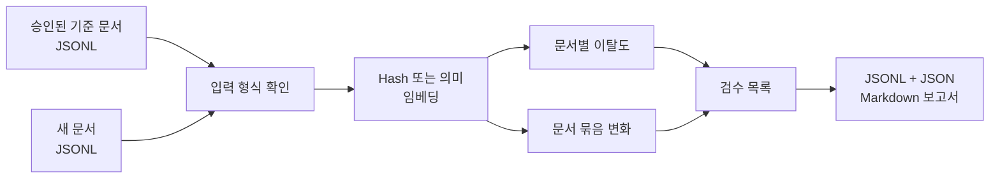

<div align="center">

# 정답지 없이 OCR 오류 위험을 먼저 찾기

**OCR 신뢰도와 임베딩 이탈도를 비교해 검수할 문서와 문서 묶음의 순서를 정합니다.**


[문제](#문제) · [실험](#무엇을-비교했나) · [결과](#실험에서-확인한-것) · [공개 도구](#공개한-도구) · [실행](#빠르게-확인하기)

</div>

## 30초 요약

- OCR의 문자 오류율을 계산하려면 사람이 만든 정답 전사본이 필요합니다.
- 정답이 아직 없는 시점에 OCR 신뢰도와 임베딩 기반 이탈도로 검수 대상을 먼저 고를 수 있는지 실험했습니다.
- 예상과 달리 OCR 신뢰도가 강한 기준선이었습니다. 임베딩을 더했을 때의 이득은 오류 유형마다 달랐습니다.
- 공개 저장소에는 승인된 문서와 새 문서를 비교해 검수 목록을 만드는 CLI, 예제와 테스트를 담았습니다.

## 문제

OCR 품질은 CER이나 WER로 평가할 수 있지만 두 지표 모두 정답 전사본이 필요합니다. 새 문서가 들어온 직후에는 정답이 없을 수 있고, 모든 문서를 사람이 먼저 읽는 것도 어렵습니다.

이 프로젝트는 OCR 모델의 신뢰도와 결과 문장의 임베딩 이탈도를 비교했습니다. 두 신호로 사람이 먼저 확인할 문서와 문서 묶음의 순서를 정합니다. 오류의 정답 판정은 하지 않습니다. 정답 전사본은 탐지기의 입력에는 쓰지 않았고 연구 결과를 평가할 때만 사용했습니다.

## 무엇을 비교했나

| 신호 | 확인하려는 것 |
|---|---|
| OCR 신뢰도 | OCR 모델이 자신의 인식 결과를 얼마나 확신하는가 |
| 임베딩 이탈도 | 인식된 문장이 승인된 정상 문서의 의미 공간에서 얼마나 멀어졌는가 |
| 문서 점수 | 개별 문서가 평소와 얼마나 다른가 |
| 문서 묶음 변화 | 새 양식이나 공급처처럼 입력 전체의 분포가 함께 바뀌었는가 |

처음에는 임베딩이 신뢰도에서 놓치는 오류를 전반적으로 보완할 것으로 예상했습니다. 문서가 크게 훼손되면 OCR 결과의 의미 구조도 함께 흐트러질 것이라고 봤기 때문입니다.

숫자 한 자리처럼 문서 전체 의미를 거의 바꾸지 않는 오류는 별도로 생각했습니다. 금액, 날짜, 비율은 한 글자만 틀려도 중요하지만 문서 임베딩은 거의 움직이지 않을 수 있습니다. 문서 전체가 깨지는 문제와 중요한 필드 하나가 틀리는 문제를 같은 탐지기로 풀기 어렵다는 가정도 함께 확인했습니다.

## 실험에서 확인한 것

FUNSD 199개 문서에 9개 조건을 적용한 1,791건과 CORD v2 200개 문서에 6개 조건을 적용한 1,200건을 평가했습니다.

| 대표 조건 | 신뢰도 AUPRC | 함께 사용한 신호 | 결합 AUPRC |
|---|---:|---|---:|
| FUNSD 전체 열화 | 0.8295 | 신뢰도 + 임베딩 방향 특징 | 0.8454 |
| CORD 영문자 불일치 | 0.5907 | 신뢰도 + kNN5 | 0.6904 |

임베딩을 더한다고 모든 조건이 좋아지지는 않았습니다. 흐림이나 압축처럼 문서 전체가 훼손된 경우에는 신뢰도가 잘 작동했습니다. 반면 금액, 금리, 날짜처럼 한 글자의 영향이 큰 오류는 신뢰도와 문서 단위 임베딩이 모두 놓칠 수 있었습니다.

이 실험에서는 신뢰도를 기본값으로 두고, 특정 오류 유형에서 임베딩 이탈도를 보조 신호로 쓰는 편이 결과와 맞았습니다. 임베딩이 신뢰도보다 항상 낫다는 결론은 내리지 않았습니다.

## 공개한 도구

공개 저장소에는 원 OCR 데이터와 전체 추론·훼손 생성 파이프라인을 넣지 않았습니다. 대신 승인된 기준 문서와 새 문서를 비교해 검수 목록을 만드는 CLI를 제공합니다.

> 위 AUPRC 표는 원 실험에서 얻은 결과입니다. 현재 공개된 CLI는 임베딩 변화 계산과 검수 목록 생성을 재현하지만, OCR 추론과 훼손 조건까지 포함한 원 벤치마크를 다시 실행하지는 않습니다.



위험이 낮은 문서는 기존 처리 흐름으로 보내고, 점수가 높은 문서는 재인식, 대체 모델 또는 사람 검수 대상으로 올릴 수 있습니다. 문서 묶음 변화는 양식이나 공급처가 한꺼번에 바뀌었는지 확인하는 경보로 사용할 수 있습니다.

## 빠르게 확인하기

```powershell
python -m venv .venv
.\.venv\Scripts\Activate.ps1
python -m pip install -e ".[dev]"
ocr-embedding-monitor --baseline examples/baseline.jsonl --candidate examples/candidate_corrupted.jsonl --output-dir outputs/demo --backend hash
pytest
```

Hash 방식은 외부 모델을 받지 않고 전체 실행 흐름을 확인하는 고정된 예제입니다. 문장의 의미를 비교하려면 sentence-transformers 방식을 사용할 수 있습니다.

## 더 자세한 내용

- [원 실험의 데이터와 조건](docs/EXPERIMENT_CONTEXT.md)
- [필드 단위 탐지와 운영 확장 항목](docs/LEARNING_ROADMAP.md)
- [입력 예제](examples/)
- [자동화 테스트](tests/)

문서 분포가 바뀌었다고 해서 OCR 오류가 생겼다고 단정할 수는 없습니다. 실제 경보 기준은 검수 결과와 업무 비용에 맞춰 조정해야 합니다. 숫자나 날짜처럼 중요한 필드의 오류를 찾으려면 문서 단위 임베딩과 별도의 필드 검사가 필요합니다.
