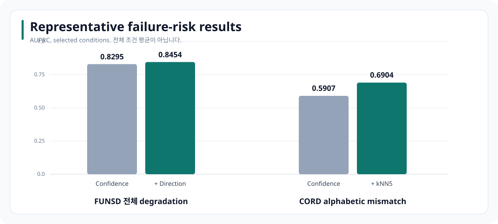
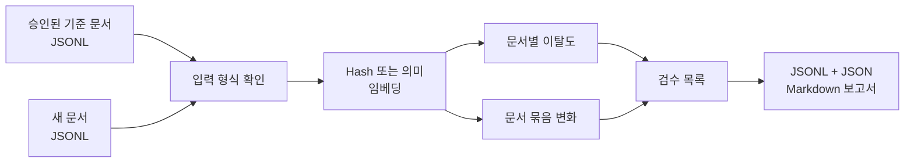

<div align="center">

# OCR Failure Risk Monitoring

**OCR text log를 embedding space에서 비교해, gold transcription 없이 failure risk를 먼저 찾을 수 있는지 검증했습니다.**


[문제](#1-왜-정답이-없는-시점에-품질-신호가-필요한가) · [아이디어](#2-아이디어의-출발점-ocr-text도-관측-데이터로-본다) · [검증](#3-가설을-검증-가능한-질문으로-나누기) · [결과](#6-검증-결과와-달라진-판단) · [CLI](#7-운영-형태-review-queue-cli) · [실행](#8-실행-방법)

</div>

## 1. 왜 정답이 없는 시점에 품질 신호가 필요한가

OCR의 문자 오류율을 계산하려면 사람이 만든 정답 전사본이 필요합니다. 실제 처리 환경에서는 새 문서가 들어올 때마다 정답을 바로 만들기 어렵고, 모든 문서를 같은 순서로 검수하면 오류 가능성이 큰 문서가 뒤로 밀릴 수 있습니다.

이 프로젝트는 정답 전사본이 아직 없는 시점에 사용할 수 있는 failure-risk signal을 찾습니다. OCR confidence와 승인된 정상 문서에서 얼마나 벗어났는지를 나타내는 embedding novelty를 비교해 review queue를 만듭니다. 이 점수는 문서의 정오를 판정하지 않습니다. 사람이 먼저 볼 대상을 정하는 데 사용합니다.

| 조건 | 가정한 상황 |
|---|---|
| Input | OCR text와 model confidence가 포함된 새 document batch가 들어옵니다. |
| Reference | 이전에 승인된 baseline document를 비교 기준으로 사용할 수 있습니다. |
| Gold label | Monitoring 시점에는 새 batch의 gold transcription이 없습니다. |
| Output | Record-level anomaly와 batch-level drift를 계산해 review priority를 반환합니다. |
| Scope | 자동 교정이나 field-level correctness 판정은 구현 범위가 아닙니다. |

## 2. 아이디어의 출발점: OCR text도 관측 데이터로 본다

출발점은 이미지 원본이나 정답 전사본을 바로 확인하기 어렵고, OCR 결과가 text log로 쌓이는 상황이었습니다.

> **OCR text를 embedding vector로 바꿔 정상 batch와 비교하면, vector의 이동 방향과 퍼지는 정도로 이상 징후를 찾을 수 있지 않을까?**

이 질문을 개별 문서와 새 batch, 두 수준으로 나눴습니다.

| 관찰 단위 | 아이디어를 계산으로 옮긴 방법 |
|---|---|
| 개별 문서 | 승인된 정상 문서 중 가장 가까운 이웃과의 cosine distance를 구해, 평소 text와 멀어진 문서를 찾습니다. |
| 새 document batch | Embedding centroid의 방향 변화, MMD와 평균 이웃 거리 비율을 함께 계산해 전체 분포의 이동과 이웃 간격 변화를 봅니다. |

Text만 남는 환경에서도 embedding signal은 계산할 수 있습니다. OCR confidence가 함께 남는다면 두 신호를 비교할 수 있습니다. 실험에서는 confidence가 예상보다 강한 baseline이었고, embedding은 일부 오류와 batch 변화에서만 보완 효과가 있었습니다. 그래서 embedding을 confidence의 대체재가 아니라 text log에서 추가로 얻는 risk signal로 정리했습니다.

## 3. 가설을 검증 가능한 질문으로 나누기

처음 가설은 embedding 변화가 confidence에서 놓친 OCR 오류를 폭넓게 보완할 것이라는 생각이었습니다. 이를 세 가지 질문으로 나눠 확인했습니다.

| 질문 | 확인 방법 |
|---|---|
| 문서 전체가 흐려지거나 압축되면 어떤 신호가 먼저 움직이는가? | Confidence와 document embedding novelty를 같은 조건에서 비교했습니다. |
| 한두 글자만 바뀌는 오류도 문서 embedding으로 찾을 수 있는가? | 문서 전체 열화와 critical-field omission·substitution을 분리했습니다. |
| 개별 문서의 이상과 batch 전체의 변화는 같은가? | Record-level novelty와 centroid·MMD 기반 batch drift를 따로 계산했습니다. |

FUNSD 1,791건과 CORD v2 1,200건에서 이 질문을 평가했습니다. 예상과 달리 confidence가 강한 기준선이었고, embedding은 일부 오류 조건에서만 도움이 됐습니다. 이 결과에 맞춰 최종 CLI도 두 신호를 함께 보여주는 검수 도구로 만들었습니다.

## 4. 어떤 신호를 계산했는가

| 신호 | 확인하려는 변화 |
|---|---|
| OCR 신뢰도 | OCR 모델이 인식 결과를 얼마나 확신하는가 |
| 임베딩 이탈도 | 인식 문장이 승인된 정상 문서의 의미 공간에서 얼마나 멀어졌는가 |
| 문서 점수 | 개별 문서가 평소 문서와 얼마나 다른가 |
| 문서 묶음 변화 | 양식이나 공급처처럼 입력 전체의 분포가 함께 달라졌는가 |

처음에는 문서가 훼손되면 OCR 결과의 의미 구조도 달라질 것이므로, 임베딩이 신뢰도에서 놓친 오류를 폭넓게 보완할 것으로 예상했습니다.

실제 문서에는 성격이 다른 오류가 섞여 있었습니다. 흐림이나 압축처럼 문서 전체가 깨지면 신뢰도와 임베딩이 함께 움직일 수 있습니다. 반면 금액, 날짜, 비율처럼 한 글자가 중요한 항목은 잘못 인식돼도 문서 전체 의미가 거의 달라지지 않습니다. 그래서 문서 전체 열화와 일부 문자 오류를 나눠 결과를 확인했습니다.

## 5. 평가 설계: label은 사후 채점에만 사용

| 데이터 | 문서 수 | 조건 수 | 평가 건수 |
|---|---:|---:|---:|
| FUNSD | 199 | 9 | 1,791 |
| CORD v2 | 200 | 6 | 1,200 |

고정된 RapidOCR 설정으로 흐림, 압축, 축소와 대비 변화처럼 문서 전체에 영향을 주는 조건을 만들었습니다. FUNSD는 149개 clean reference와 50개 test document, CORD v2는 100개 train과 100개 test receipt로 나눴습니다. Text embedding은 `BAAI/bge-m3`, clean-reference novelty는 cosine kNN `k=5`로 계산했습니다.

정답 전사본은 신호를 만들 때 사용하지 않았고, 각 점수가 실제 오류를 얼마나 잘 앞에 배치했는지 사후 평가할 때만 사용했습니다. 주요 지표는 class imbalance를 반영하는 AUPRC로 두고 AUROC와 Recall@5% FPR을 함께 확인했습니다. 신뢰구간은 같은 문서에서 나온 여러 열화 조건을 한 묶음으로 resampling하는 document-cluster bootstrap으로 계산했습니다.

## 6. 검증 결과와 달라진 판단

| 대표 조건 | 신뢰도 AUPRC | 함께 사용한 신호 | 결합 AUPRC |
|---|---:|---|---:|
| FUNSD 전체 열화 | 0.8295 | 신뢰도 + 임베딩 방향 특징 | 0.8454 |
| CORD 영문자 불일치 | 0.5907 | 신뢰도 + kNN5 | 0.6904 |



임베딩을 더한다고 모든 조건이 좋아지지는 않았습니다. 문서 전체가 훼손된 조건에서는 OCR 신뢰도만으로도 오류 위험을 잘 정렬했습니다. 일부 조건에서는 임베딩을 함께 썼을 때 결과가 좋아졌지만, 금액이나 날짜처럼 국소적인 오류는 두 신호 모두 놓칠 수 있었습니다.

따라서 이 실험에서는 OCR 신뢰도를 먼저 쓰고, 임베딩 이탈도는 특정 오류 유형과 문서 묶음의 변화를 살피는 보조 신호로 두는 편이 맞았습니다. 중요한 필드 한두 개의 오류는 필드 추출과 규칙 검사로 따로 확인해야 합니다.

### 중요한 오류를 나눠 보니 관측 가능한 범위가 달랐습니다

CORD의 `total`·`subtotal` 가격을 critical field로 두고, clean image에서는 맞았지만 열화 뒤 새로 누락되거나 다른 값으로 바뀐 경우를 harmful shift로 정의했습니다. 이 label은 detector 입력이 아니라 평가에만 사용했습니다.

| 확인한 질문 | 결과 | 해석 |
|---|---:|---|
| Critical harm 전체 | Confidence AUPRC 0.595 → decomposed risk 0.627 | 평균 gain의 95% CI가 0을 포함해 전체 개선은 확정하지 않았습니다. |
| Critical omission | AUPRC 0.564 → 0.668 | Bootstrap gain `+0.113`, 95% CI `[+0.013, +0.221]`로 누락에는 보완 신호가 있었습니다. |
| Critical substitution | AUPRC 0.136 → 0.110 | 결합 신호가 confidence를 개선하지 못했고 Recall@5% FPR도 0이었습니다. |
| OOD 숫자 치환 | Value-only embedding AUROC 0.972 | 정상 문서 공간에서 벗어난 값은 잘 구분했습니다. |
| 정상 분포 안의 값 교환 | Value-only embedding AUROC 0.415 | 그럴듯한 값끼리 바뀌면 embedding distance로 구분하지 못했습니다. |

이 결과를 통해 `embedding을 쓰면 OCR 오류를 찾을 수 있다`보다 좁은 결론을 남겼습니다. Text-only signal은 out-of-support value와 omission에는 도움이 될 수 있지만, 의미 공간 안에서 일어난 valid-value substitution의 correctness를 보장하지 않습니다. 운영에서는 confidence를 기본 triage 신호로 쓰고 embedding novelty, field coverage와 numeric-output shift를 함께 보되, 금액처럼 중요한 필드는 규칙 검사나 표본 검수를 별도로 붙여야 합니다.

## 7. 운영 형태: review queue CLI

승인된 기준 문서와 새 문서를 비교해 검수 목록을 만드는 작은 CLI를 제공합니다. 원 corpus, OCR 추론 결과와 대용량 실험 중간 산출물은 공개하지 않았습니다. CLI는 연구 아이디어를 운영 입력 형식으로 단순화한 실행 예시입니다.



위 AUPRC 결과는 원 실험의 검증된 집계값입니다. CLI는 임베딩 변화 계산과 검수 목록 생성 과정을 빠르게 확인하는 용도이며, 같은 성능 수치를 재현하는 benchmark runner는 아닙니다.

```text
src/ocr_embedding_monitor/   입력 검사, 임베딩, 이탈도와 보고서 생성
examples/                    승인 문서와 새 문서 JSONL 예제
tests/                       입력, 탐지기와 전체 실행 테스트
docs/                        원 실험의 범위와 후속 운영 계획
outputs/                     실행할 때 생성되는 검수 목록과 보고서
```

## 8. 실행 방법

```powershell
python -m venv .venv
.\.venv\Scripts\Activate.ps1
python -m pip install -e ".[dev]"
ocr-embedding-monitor --baseline examples/baseline.jsonl --candidate examples/candidate_corrupted.jsonl --output-dir outputs/demo --backend hash
pytest
```

Hash 방식은 외부 모델을 받지 않고 실행 흐름을 확인하기 위한 고정 예제입니다. 문장의 의미를 비교하려면 sentence-transformers 방식을 사용할 수 있습니다.

원 실험의 데이터와 조건은 [EXPERIMENT_CONTEXT.md](docs/EXPERIMENT_CONTEXT.md), 필드 단위 탐지와 운영 확장 항목은 [LEARNING_ROADMAP.md](docs/LEARNING_ROADMAP.md)에 정리했습니다.

## 9. 해석 범위와 한계

- 결과는 FUNSD와 CORD v2에 인위적인 열화와 문자 오류를 적용한 조건에서 확인했습니다.
- 문서 분포가 달라졌다고 해서 OCR 오류가 생겼다고 단정할 수는 없습니다.
- 실제 경보 기준은 검수 결과와 업무 비용에 맞춰 다시 정해야 합니다.
- 숫자나 날짜처럼 중요한 필드의 오류를 찾으려면 문서 단위 임베딩과 별도의 필드 검사가 필요합니다.
- 공개 CLI의 합성 예제는 실행 경로를 확인하기 위한 것이며 위 AUPRC 결과를 재현하지 않습니다.
