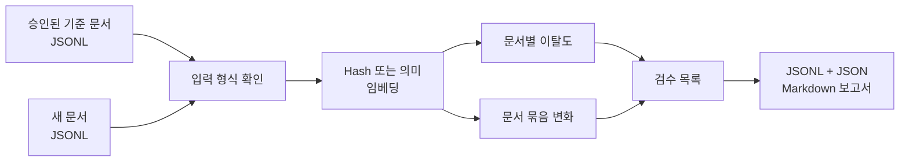

<div align="center">

# OCR Failure Risk Monitoring

**Gold transcription이 도착하기 전에 OCR confidence와 embedding drift로 review priority를 정합니다.**


[Problem](#1-problem-and-operating-setting) · [Method](#3-method-confidence-and-embedding-drift) · [Protocol](#4-experimental-protocol) · [Results](#5-results) · [CLI](#6-public-monitoring-cli) · [Quick start](#7-quick-start)

</div>

## 1. Problem and operating setting

OCR의 문자 오류율을 계산하려면 사람이 만든 정답 전사본이 필요합니다. 실제 처리 환경에서는 새 문서가 들어올 때마다 정답을 바로 만들기 어렵고, 모든 문서를 같은 순서로 검수하면 오류 가능성이 큰 문서가 뒤로 밀릴 수 있습니다.

이 프로젝트에서는 정답 전사본이 아직 없는 시점에 사용할 수 있는 failure-risk signal을 찾았습니다. OCR confidence와 승인된 정상 문서에서 얼마나 벗어났는지를 나타내는 embedding novelty를 비교해 review queue를 만듭니다. 이 점수는 문서가 틀렸다고 판정하는 값이 아니라, 사람이 먼저 볼 대상을 고르는 기준입니다.

| 조건 | 가정한 상황 |
|---|---|
| Input | OCR text와 model confidence가 포함된 새 document batch가 들어옵니다. |
| Reference | 이전에 승인된 baseline document를 비교 기준으로 사용할 수 있습니다. |
| Gold label | Monitoring 시점에는 새 batch의 gold transcription이 없습니다. |
| Output | Record-level anomaly와 batch-level drift를 계산해 review priority를 반환합니다. |
| Scope | 자동 교정이나 field-level correctness 판정은 구현 범위가 아닙니다. |

## 2. Design rationale

- OCR confidence와 document embedding novelty를 gold-free review signal로 비교했습니다.
- FUNSD 1,791건과 CORD v2 1,200건에서 문서 전체 열화와 일부 문자 오류를 나눠 살폈습니다.
- 처음 예상과 달리 OCR 신뢰도가 강한 기준선이었습니다. 임베딩은 일부 오류 조건에서만 도움이 됐습니다.
- 공개 저장소에는 승인된 document batch와 새 batch를 비교해 review queue를 만드는 CLI, example과 test를 담았습니다.

## 3. Method: confidence and embedding drift

| 신호 | 확인하려는 변화 |
|---|---|
| OCR 신뢰도 | OCR 모델이 인식 결과를 얼마나 확신하는가 |
| 임베딩 이탈도 | 인식 문장이 승인된 정상 문서의 의미 공간에서 얼마나 멀어졌는가 |
| 문서 점수 | 개별 문서가 평소 문서와 얼마나 다른가 |
| 문서 묶음 변화 | 양식이나 공급처처럼 입력 전체의 분포가 함께 달라졌는가 |

처음에는 문서가 훼손되면 OCR 결과의 의미 구조도 달라질 것이므로, 임베딩이 신뢰도에서 놓친 오류를 폭넓게 보완할 것으로 예상했습니다.

실제 문서에는 성격이 다른 오류가 섞여 있었습니다. 흐림이나 압축처럼 문서 전체가 깨지면 신뢰도와 임베딩이 함께 움직일 수 있습니다. 반면 금액, 날짜, 비율처럼 한 글자가 중요한 항목은 잘못 인식돼도 문서 전체 의미가 거의 달라지지 않습니다. 그래서 문서 전체 열화와 일부 문자 오류를 나눠 결과를 확인했습니다.

## 4. Experimental protocol

| 데이터 | 문서 수 | 조건 수 | 평가 건수 |
|---|---:|---:|---:|
| FUNSD | 199 | 9 | 1,791 |
| CORD v2 | 200 | 6 | 1,200 |

흐림, 압축, 축소와 대비 변화처럼 문서 전체에 영향을 주는 조건을 포함했습니다. 숫자나 일부 문자만 달라지는 오류도 따로 확인했습니다. 정답 전사본은 신호를 계산할 때 사용하지 않았고, 각 방법이 오류 문서를 얼마나 잘 앞에 배치했는지 평가할 때만 사용했습니다.

## 5. Results

| 대표 조건 | 신뢰도 AUPRC | 함께 사용한 신호 | 결합 AUPRC |
|---|---:|---|---:|
| FUNSD 전체 열화 | 0.8295 | 신뢰도 + 임베딩 방향 특징 | 0.8454 |
| CORD 영문자 불일치 | 0.5907 | 신뢰도 + kNN5 | 0.6904 |


임베딩을 더한다고 모든 조건이 좋아지지는 않았습니다. 문서 전체가 훼손된 조건에서는 OCR 신뢰도만으로도 오류 위험을 잘 정렬했습니다. 일부 조건에서는 임베딩을 함께 썼을 때 결과가 좋아졌지만, 금액이나 날짜처럼 국소적인 오류는 두 신호 모두 놓칠 수 있었습니다.

따라서 이 실험에서는 OCR 신뢰도를 먼저 쓰고, 임베딩 이탈도는 특정 오류 유형과 문서 묶음의 변화를 살피는 보조 신호로 두는 편이 맞았습니다. 중요한 필드 한두 개의 오류는 필드 추출과 규칙 검사로 따로 확인해야 합니다.

## 6. Public monitoring CLI

공개 저장소에는 원 OCR 데이터와 전체 추론·훼손 생성 파이프라인을 넣지 않았습니다. 대신 승인된 기준 문서와 새 문서를 비교해 검수 목록을 만드는 작은 CLI를 제공합니다.



위 AUPRC 결과는 원 실험에서 얻은 값입니다. 공개 CLI는 임베딩 변화 계산과 검수 목록 생성 과정을 실행하지만, OCR 추론과 훼손 조건을 포함한 원 실험을 다시 만들지는 않습니다.

```text
src/ocr_embedding_monitor/   입력 검사, 임베딩, 이탈도와 보고서 생성
examples/                    승인 문서와 새 문서 JSONL 예제
tests/                       입력, 탐지기와 전체 실행 테스트
docs/                        원 실험의 범위와 후속 운영 계획
outputs/                     예제 실행 결과
```

## 7. Quick start

```powershell
python -m venv .venv
.\.venv\Scripts\Activate.ps1
python -m pip install -e ".[dev]"
ocr-embedding-monitor --baseline examples/baseline.jsonl --candidate examples/candidate_corrupted.jsonl --output-dir outputs/demo --backend hash
pytest
```

Hash 방식은 외부 모델을 받지 않고 실행 흐름을 확인하기 위한 고정 예제입니다. 문장의 의미를 비교하려면 sentence-transformers 방식을 사용할 수 있습니다.

원 실험의 데이터와 조건은 [EXPERIMENT_CONTEXT.md](docs/EXPERIMENT_CONTEXT.md), 필드 단위 탐지와 운영 확장 항목은 [LEARNING_ROADMAP.md](docs/LEARNING_ROADMAP.md)에 정리했습니다.

## 8. Limitations

- 결과는 FUNSD와 CORD v2에 인위적인 열화와 문자 오류를 적용한 조건에서 확인했습니다.
- 문서 분포가 달라졌다고 해서 OCR 오류가 생겼다고 단정할 수는 없습니다.
- 실제 경보 기준은 검수 결과와 업무 비용에 맞춰 다시 정해야 합니다.
- 숫자나 날짜처럼 중요한 필드의 오류를 찾으려면 문서 단위 임베딩과 별도의 필드 검사가 필요합니다.
- 공개 CLI의 합성 예제는 실행 경로를 확인하기 위한 것이며 위 AUPRC 결과를 재현하지 않습니다.
