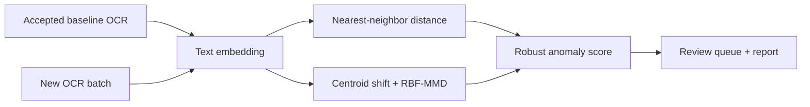

<div align="center">

# Label-Free OCR Quality Monitoring

**정답 라벨이 없는 환경에서 OCR 출력 변화를 감지하고 검토 우선순위를 만드는 모니터링 도구**


</div>

## 한눈에 보기

| 항목 | 내용 |
|---|---|
| 문제 | 새 문서 배치에서 평소와 다른 OCR 결과를 라벨 없이 선별 |
| 입력 | 기준 OCR JSONL과 신규 OCR JSONL |
| 방법 | 텍스트 임베딩, 최근접 거리, robust z-score, centroid shift, RBF-MMD |
| 출력 | 위험 수준, 검토 추천 레코드, 요약 JSON·JSONL·Markdown 리포트 |
| 범위 | 정확도 저하를 단정하지 않는 **품질 위험·검토 우선순위 도구** |

## 왜 만들었나

실제 운영에서는 OCR 정답이 바로 쌓이지 않아 CER·WER을 즉시 계산하기 어렵습니다.
이 프로젝트는 정확도를 추측하는 대신, 정상 배치와 비교해 의미 공간에서 멀어진
레코드와 집단 변화를 찾아 사람이 먼저 확인할 대상을 정합니다.

## 동작 흐름



## 빠른 실행

```powershell
python -m venv .venv
.\.venv\Scripts\Activate.ps1
python -m pip install -e ".[dev]"

ocr-embedding-monitor \
  --baseline examples/baseline.jsonl \
  --candidate examples/candidate_corrupted.jsonl \
  --output-dir outputs/demo \
  --backend hash

pytest
```

`hash` 백엔드는 외부 모델이나 API 없이 예제를 재현합니다. 실제 의미 기반 비교에는
`sentence-transformers` 추가 의존성과 `BAAI/bge-m3` 같은 임베딩 모델을 사용할 수 있습니다.

## 구현 내용

- JSONL 입력 검증과 안정적인 레코드 ID 처리
- deterministic hashing 및 sentence-transformers 임베딩 백엔드
- 기준 배치 leave-one-out 최근접 거리 캘리브레이션
- robust median/MAD 기반 이상 점수
- centroid cosine distance와 RBF Maximum Mean Discrepancy
- 레코드별 검토 추천 및 재현 가능한 실행 해시
- CLI, 단위 테스트, GitHub Actions

## 저장소 구성

```text
src/ocr_embedding_monitor/   detector, embedding, metrics, CLI
examples/                    합성 baseline·정상·손상 예제
tests/                       detector, I/O, end-to-end 테스트
.github/workflows/           자동 테스트
docs/LEARNING_ROADMAP.md     데이터·운영 확장 계획
```

## 해석 범위

이 도구가 출력하는 값은 OCR 정확도나 오류율이 아닙니다. 입력 분포 변화나 새로운
문서 유형처럼 검토가 필요한 변화를 우선순위화하는 신호입니다. 실제 품질 저하 판단과
임계값 보정에는 표본 검수가 필요합니다.

## 담당 역할

문제 정의, 라벨 없는 평가 경계, 위험 신호 설계와 결과 해석을 주도했습니다.
AI 코딩 도구는 구현과 디버깅에 활용했으며, 공개 코드는 합성 예제·테스트·재현 절차로
검증할 수 있게 구성했습니다.

[학습 및 운영 확장 계획](docs/LEARNING_ROADMAP.md)
