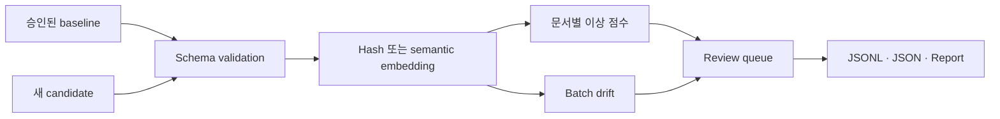

<div align="center">

**정답이 없는 OCR 운영 환경에서 검수할 문서의 우선순위를 정합니다.**


</div>

## 문제

새 OCR 문서가 들어온 직후에는 정답 transcription이 없어 CER이나 WER을 계산하지 못하는 경우가 많습니다. 라벨을 기다리는 동안 새로운 양식, 언어, 촬영 조건 또는 손상 패턴이 계속 유입될 수 있습니다. 모든 문서를 사람이 먼저 확인하는 방식도 처리량이 늘면 유지하기 어렵습니다.

이 프로젝트는 OCR 오류를 자동 판정하지 않습니다. 모델의 confidence와 정상 문서에서 벗어난 정도를 이용해 사람이 먼저 볼 문서를 정렬합니다. 정답 transcription은 탐지기에 넣지 않고 연구 결과를 사후 평가할 때만 사용했습니다.

## 연구 설계

### Confidence를 먼저 기준선으로 사용

OCR 모델이 내놓는 confidence는 별도 모델 없이 사용할 수 있고 실제로 여러 손상 조건에서 강한 기준선이었습니다. Embedding 신호의 효과를 평가할 때도 confidence보다 나은지가 아니라, confidence가 놓치는 오류를 보완하는지를 확인했습니다.

### 정상 문서와의 거리를 추가

승인된 문서와 새 OCR 결과를 같은 임베딩 공간에 놓고 문서별 거리와 batch 전체의 이동을 따로 측정했습니다. 개별 이상은 leave-one-out 최근접 거리와 median/MAD 점수로 정렬했고, 공급처나 양식 전체가 달라지는 경우는 centroid cosine distance와 RBF-MMD로 확인했습니다.

Embedding distance가 크다고 OCR이 틀렸다는 뜻은 아닙니다. 정상적인 새 양식도 기존 문서에서 멀리 떨어질 수 있으므로 이 값은 자동 차단이 아니라 검수 순서에만 사용합니다.

### 문서 전체 오류와 필드 오류를 구분

흐림이나 압축처럼 문서 전체에 영향을 주는 손상은 confidence나 embedding에서 드러날 수 있습니다. 반면 금액, 날짜, 비율처럼 짧은 필드 하나만 틀리면 문서 전체 의미가 거의 유지됩니다. 이런 오류에는 필드 추출, 규칙 검사와 별도 검증이 필요합니다.

## 연구 결과

FUNSD 199개 문서에는 9개 조건을 적용해 1,791건을, CORD v2 200개 문서에는 6개 조건을 적용해 1,200건을 평가했습니다.

| 대표 조건 | Confidence AUPRC | 결합 신호 | 결합 AUPRC |
|---|---:|---|---:|
| FUNSD 전체 degradation | 0.8295 | confidence + direction | 0.8454 |
| CORD alphabetic mismatch | 0.5907 | confidence + kNN5 | 0.6904 |

FUNSD 전체 손상에서는 confidence가 이미 강해 embedding을 추가한 이득이 작았습니다. CORD의 alphabetic mismatch에서는 kNN novelty가 confidence를 보완했습니다. 결합 신호가 모든 조건에서 좋아진 것은 아니며, embedding이 confidence를 대체한다고 결론내리지 않았습니다.

실험 데이터와 조건은 [Experiment context](docs/EXPERIMENT_CONTEXT.md)에 정리했습니다.

## 공개 구현

원 corpus와 전체 OCR inference 결과는 배포하지 않습니다. 공개 저장소는 승인 baseline과 새 candidate를 받아 문서별 검수 순서와 batch 이동을 계산하는 작은 CLI입니다.



Deterministic hash backend는 외부 모델 없이 입력, 점수와 출력 계약을 확인하기 위한 구현입니다. 실제 의미 기반 비교에는 sentence-transformers backend를 사용할 수 있습니다. 결과에는 문서별 검수 순서, batch summary, Markdown report와 같은 입력·설정을 식별하는 run hash가 포함됩니다.

## 실행

```powershell
python -m venv .venv
.\.venv\Scripts\Activate.ps1
python -m pip install -e ".[dev]"

ocr-embedding-monitor `
  --baseline examples/baseline.jsonl `
  --candidate examples/candidate_corrupted.jsonl `
  --output-dir outputs/demo `
  --backend hash

pytest
```

예제는 합성 문서로 실행 경로를 확인합니다. 위 연구 성능을 재현하는 데이터는 아닙니다.

## 한계

- 분포 이동이 곧 OCR 품질 저하를 뜻하지는 않습니다.
- 실제 경보 기준은 검수 결과와 오류 비용을 이용해 보정해야 합니다.
- 정상적인 새 문서 유형은 승인 절차를 거쳐 baseline에 반영해야 합니다.
- 문서 임베딩은 숫자나 핵심 단어 하나만 틀린 오류를 놓칠 수 있습니다.
- 이 신호만으로 개인정보나 안전 관련 결정을 자동화해서는 안 됩니다.

## 작업 범위

개인 연구 프로젝트로 정답 없는 환경의 탐지 문제, confidence 기준선, embedding novelty 가설, 오류 조건과 평가 방향을 설계했습니다. Codex를 사용해 OCR inference와 corruption 실험, feature·detector 비교, 집계 코드와 공개 CLI를 반복 수정하고 검증했습니다.

[Experiment context](docs/EXPERIMENT_CONTEXT.md) · [운영 확장 계획](docs/LEARNING_ROADMAP.md)
