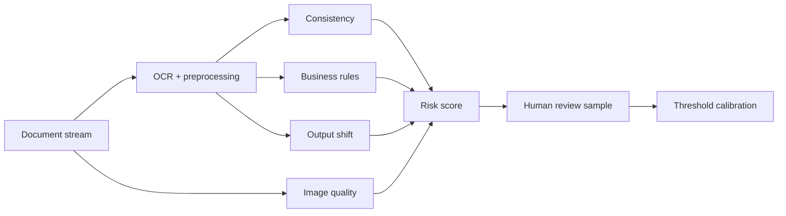

# Label-Free OCR Quality Monitoring

> 정답 라벨이 바로 생기지 않는 운영 환경에서 OCR 성능 저하를 단정하지 않고, **품질 위험 신호**를 조기에 선별하는 모니터링 프로토타입입니다.

**Status:** Portfolio implementation plan · Problem formulation completed

## 문제 정의

고정된 OCR 모델의 품질은 저절로 낮아지지 않습니다. 운영 품질은 입력 문서, 촬영 환경, 전처리 파이프라인, 모델·라이브러리 버전이 달라질 때 흔들립니다. 하지만 gold text가 없으면 CER/WER 하락을 직접 계산할 수 없습니다.

따라서 이 프로젝트는 `정확도 하락 탐지`가 아니라 `검토가 필요한 품질 위험 탐지`를 목표로 합니다.

## 위험 신호

| 신호 | 예시 | 역할 |
|---|---|---|
| 예측 일관성 | TTA 결과 간 edit distance | 작은 입력 변화에 출력이 불안정한지 측정 |
| 모델 불일치 | ensemble 간 disagreement | 모델별 판독 차이를 위험 신호로 사용 |
| 업무 규칙 | 날짜·금액 형식, 합계 검증 | 명확한 구조 위반 검출 |
| 이미지 품질 | blur, contrast, skew | 입력 분포 변화의 원인 후보 제공 |
| 출력 분포 | 길이, 문자 비율, 필드 결측률 | 시간에 따른 집단 변화 감지 |
| 내부 confidence | token/line confidence | 모델 자체 신뢰도 보조 신호 |

## 내가 주도한 부분

- `모델 드리프트`와 `운영 입력·파이프라인 변화`를 구분
- 라벨 없이 CER/WER 저하를 주장할 수 없다는 평가 경계 설정
- 단일 confidence가 아닌 일관성·규칙·입력 품질·분포 변화를 결합한 risk score 설계
- 위험 표본을 사람이 검수하고 그 결과로 임계값을 보정하는 closed loop 제안

## 목표 아키텍처

## 현재 한계

- 아직 공개 가능한 실제 운영 데이터와 완성된 구현체는 없습니다.
- 위험 점수는 정확도 자체가 아니며, 소량의 수동 라벨로 탐지력을 검증해야 합니다.
- 문서 유형별 규칙과 임계값이 달라 도메인별 calibration이 필요합니다.

## 구현 계획

- [ ] 합성 영수증·문서 데이터와 변형 generator
- [ ] typed OCR event schema와 batch ingestion
- [ ] consistency·rule·image-quality feature 구현
- [ ] 시간창별 drift detector와 alert 정책
- [ ] 수동 검수 sample을 이용한 Precision@k·Risk Lift 평가
- [ ] FastAPI, PostgreSQL, dashboard, Docker, CI

자세한 학습 계획은 [LEARNING_ROADMAP.md](docs/LEARNING_ROADMAP.md)에 정리했습니다.

## 개발 방식

문제 정의와 평가 경계, 위험 신호 설계는 직접 수행했습니다. 구현 단계에서는 AI 코딩 도구를 활용하되, 합성 테스트·타입·데이터 검증·재현 절차로 결과를 직접 검증할 계획입니다.

