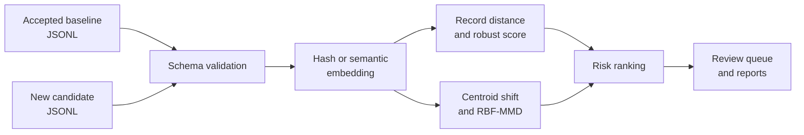

<div align="center">

**정답 transcription이 늦게 도착하는 OCR pipeline에서 embedding drift를 측정해 먼저 검수할 record와 batch를 정하는 CLI**


[동작 구조](#동작-구조) · [빠른 실행](#빠른-실행) · [출력](#출력) · [미구현 확장](docs/LEARNING_ROADMAP.md)

</div>

---

## 문제

새 OCR 문서가 들어온 순간에는 정답 transcription이 없어 CER이나 WER을 계산할 수 없는 경우가 많습니다. 라벨을 기다리는 동안 새로운 문서 양식, 언어, 촬영 조건과 손상 패턴을 늦게 발견할 수 있습니다.

이 도구는 승인된 baseline과 새 candidate의 embedding을 비교합니다. 개별 record가 baseline에서 얼마나 떨어졌는지와 batch 전체 분포가 얼마나 이동했는지를 따로 계산하고, 사람이 먼저 확인할 review queue를 만듭니다.

이 점수는 OCR accuracy가 아닙니다. 라벨이 도착하기 전 제한된 검수 시간을 어디에 먼저 쓸지 정하는 신호입니다.

## 동작 구조



| 수준 | 신호 | 용도 |
|---|---|---|
| Record | baseline leave-one-out nearest-neighbor distance와 median/MAD score | 먼저 검수할 record 정렬 |
| Batch | centroid cosine distance와 RBF-MMD | 전체 입력 분포 이동 확인 |

## 구현 범위

- JSONL schema validation과 stable record ID
- deterministic hash backend와 sentence-transformers backend
- record anomaly score와 batch drift signal
- review JSONL, summary JSON, Markdown report와 reproducible run hash
- installable CLI, synthetic examples, tests와 GitHub Actions

## 빠른 실행

```powershell
python -m venv .venv
.\.venv\Scripts\Activate.ps1
python -m pip install -e ".[dev]"

ocr-embedding-monitor \
  --baseline examples/baseline.jsonl \
  --candidate examples/candidate_corrupted.jsonl \
  --output-dir outputs/demo \
  --backend hash

pytest
```

`hash` backend는 외부 모델과 API 없이 전체 흐름을 확인하기 위한 deterministic demo입니다. 의미 기반 비교에는 sentence-transformers backend를 사용할 수 있습니다.

## 출력

| 파일 | 용도 |
|---|---|
| Summary JSON | batch signal과 실행 설정 |
| Review JSONL | record별 검수 우선순위 |
| Markdown report | 사람이 읽는 실행 요약 |
| Run hash | 입력과 설정이 같은 실행 추적 |

## 해석 범위

- domain shift가 품질 저하를 의미하지는 않습니다.
- 실제 alert threshold는 검수 결과와 업무 비용으로 보정해야 합니다.
- 정상적인 새 문서 유형은 승인 후 baseline 갱신 절차가 필요합니다.
- embedding distance만으로 개인정보나 안전 관련 결정을 자동화해서는 안 됩니다.
- 현재 공개 결과는 synthetic fixture로 실행 경로를 검증한 것이며, 실제 OCR corpus의 error detection 성능을 주장하지 않습니다.

## 기여

문제 정의, label-free signal의 역할, record와 batch 신호 조합, 출력 계약과 해석 범위를 설계했습니다. 공개 코드는 synthetic example, deterministic backend, 테스트와 CI로 전체 경로를 확인할 수 있게 구성했습니다.

[미구현 운영 확장 계획](docs/LEARNING_ROADMAP.md)
