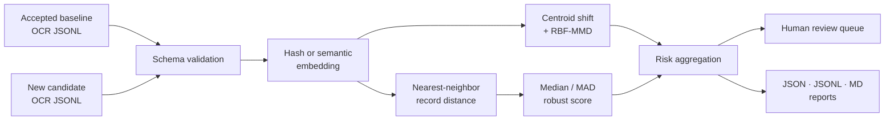

<div align="center">

**Gold label이 늦게 도착하는 OCR pipeline에서 embedding-space local/global drift를 측정하고, record-level review queue와 batch risk signal을 생성하는 label-free monitor**


[문제와 판단](#문제와-판단) · [동작 구조](#모니터링-흐름) · [빠른 실행](#빠른-실행) · [운영 확장](docs/LEARNING_ROADMAP.md)

</div>

---

## 이 프로젝트는

OCR 운영 환경에서는 새 문서가 들어온 직후 정답 transcription이 없는 경우가 많습니다. CER이나 WER을 계산할 수 있을 때까지 기다리면 새로운 문서 양식, 언어, 촬영 조건과 손상 패턴을 늦게 발견합니다. 이 프로젝트는 정상으로 승인된 baseline과 새 candidate의 embedding을 비교해 라벨 없이 변화를 감시합니다.

개별 record가 baseline에서 얼마나 떨어졌는지와 batch 전체 분포가 얼마나 이동했는지를 따로 계산합니다. 두 신호는 정확도 추정치가 아니라 사람의 검수 순서를 정하는 데 사용합니다. 실행 결과는 review queue, batch summary와 Markdown report로 남습니다.

### 시작한 이유

운영 모니터링은 라벨이 준비된 실험 환경보다 먼저 작동해야 합니다. 완전 자동 판정 대신 이상 가능성이 큰 결과를 먼저 보여주면 제한된 검수 시간을 더 필요한 곳에 쓸 수 있습니다. 이 판단을 설치 가능한 CLI와 테스트가 있는 작은 패키지로 구현했습니다.

### 이 프로젝트에서 적용한 접근

실제 OCR 운영에서는 새 batch가 들어온 순간 정답 transcription이 없다는 조건부터 고정했습니다. 먼저 synthetic data와 deterministic hash backend로 설치, 입력 검증, score 계산과 report 생성이 한 번에 작동하는 작은 CLI를 만들었습니다. 그다음 개별 record의 이상과 batch 전체의 이동을 분리해 어떤 수준에서 문제가 생겼는지 볼 수 있게 했습니다.

출력은 자동 합격 판정이 아니라 검수 순서를 정하는 신호로 제한했습니다. 정확도처럼 보일 수 있는 표현을 피하고, run hash와 summary를 남겨 같은 실행을 다시 확인할 수 있게 했습니다. 실제 배포에 필요한 baseline versioning, dashboard와 feedback loop는 학습 로드맵에 구분해 두었습니다.

## 상세 설명

| 구분 | 내용 |
|---|---|
| **Input** | accepted baseline JSONL과 새 candidate JSONL |
| **Local signal** | baseline leave-one-out nearest-neighbor distance를 median/MAD로 calibration해 record anomaly score를 계산 |
| **Global signal** | centroid cosine distance와 RBF-MMD로 candidate batch 전체의 분포 이동을 측정 |
| **Output** | review JSONL, batch summary JSON, Markdown report, reproducible run hash |
| **Verification** | synthetic fixture, deterministic hash backend, unit test, GitHub Actions |

출력값은 OCR accuracy나 CER/WER의 대체값이 아닙니다. 라벨이 도착하기 전 검토 예산을 어디에 먼저 쓸지 정하는 risk signal입니다.

## 문제와 판단

운영 환경에서는 새 문서가 들어온 순간 정답 transcription이 존재하지 않는 경우가 많습니다. 그렇다고 라벨이 쌓일 때까지 아무것도 보지 않으면 새로운 양식·언어·손상 패턴을 늦게 발견합니다.

그래서 두 수준의 신호를 분리했습니다.

| 수준 | 질문 | 신호 |
|---|---|---|
| **Record level** | 어떤 OCR 결과가 baseline에서 멀리 떨어졌는가? | nearest-neighbor distance + robust z-score |
| **Batch level** | 전체 candidate 분포가 이동했는가? | centroid cosine distance + RBF-MMD |

최종 출력은 pass/fail 정답이 아니라 검수자가 사용할 **review queue**입니다.

## 모니터링 흐름



## 구현 범위

- JSONL schema validation과 stable record ID
- deterministic hashing backend와 sentence-transformers backend
- baseline leave-one-out nearest-neighbor calibration
- median/MAD 기반 robust anomaly score
- centroid cosine distance와 RBF Maximum Mean Discrepancy
- record별 review recommendation과 reproducible run hash
- installable CLI, synthetic examples, tests, GitHub Actions
- 결과를 “accuracy”로 오해하지 않도록 명시한 interpretation boundary

## 빠른 실행

```powershell
python -m venv .venv
.\.venv\Scripts\Activate.ps1
python -m pip install -e ".[dev]"

ocr-embedding-monitor \
  --baseline examples/baseline.jsonl \
  --candidate examples/candidate_corrupted.jsonl \
  --output-dir outputs/demo \
  --backend hash

pytest
```

`hash` backend는 외부 모델·API 없이 전체 흐름을 재현합니다. 의미 기반 비교에는 `sentence-transformers` 추가 의존성과 BGE 계열 임베딩을 사용할 수 있습니다.

## 출력 형식

| 산출물 | 용도 |
|---|---|
| Summary JSON | 자동화·dashboard 연동용 batch signal |
| Review JSONL | 사람이 확인할 record 우선순위 |
| Markdown report | 실행 결과를 빠르게 검토·공유 |
| Run hash | 동일 입력·설정 실행의 추적성 |

## 저장소 구성

```text
src/ocr_embedding_monitor/   detector, embedding, metrics, CLI
examples/                    synthetic baseline and candidate batches
tests/                       detector, I/O, end-to-end tests
.github/workflows/           automated test workflow
docs/LEARNING_ROADMAP.md     data and production expansion plan
assets/                      portfolio hero artwork
```

## 해석 범위

- signal은 OCR error rate나 accuracy가 아닙니다.
- domain shift가 반드시 품질 저하를 의미하지는 않습니다.
- 실제 alert threshold는 샘플 검수와 업무 비용을 반영해 보정해야 합니다.
- 새 문서 유형이 정상 변화라면 baseline 승인·갱신 절차가 필요합니다.
- embedding distance만으로 개인정보·안전 관련 판정을 자동화해서는 안 됩니다.

## 기여 범위

문제 정의, label-free signal의 해석 범위, local/global signal 조합과 출력 계약을 설계했습니다. 공개 코드는 synthetic example, deterministic backend, 테스트와 CI로 실행 경로를 검증할 수 있게 구성했습니다.

[운영 수준 확장 로드맵](docs/LEARNING_ROADMAP.md)


