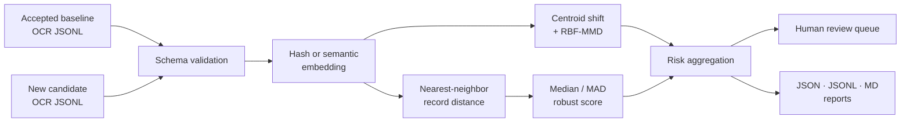

<div align="center">

**정답 라벨이 늦게 오는 환경에서 OCR 변화 신호를 검토 우선순위로 바꾸는 실행 가능한 모니터링 패키지**


[문제와 판단](#문제와-판단) · [동작 구조](#monitoring-flow) · [빠른 실행](#quick-start) · [운영 확장](docs/LEARNING_ROADMAP.md)

</div>

---

## 30초 요약

| 질문 | 답 |
|---|---|
| **문제** | CER·WER 정답이 아직 없을 때 새 OCR batch에서 무엇을 먼저 검수할까? |
| **입력** | accepted baseline JSONL + candidate JSONL |
| **판단** | 평소와 다른 OCR 결과와 전체 묶음의 변화를 함께 확인 |
| **출력** | 사람이 먼저 볼 결과를 순서대로 정리하고 보고서로 저장 |
| **검증** | synthetic fixture, deterministic backend, unit test, GitHub Actions |

<table>
<tr>
<td width="25%" align="center"><h3>정답 없이 시작</h3><sub>라벨이 늦어도<br/>바로 점검</sub></td>
<td width="25%" align="center"><h3>이상 결과 우선</h3><sub>사람이 볼<br/>순서를 자동 정리</sub></td>
<td width="25%" align="center"><h3>한 줄 실행</h3><sub>샘플 데이터로<br/>즉시 확인</sub></td>
<td width="25%" align="center"><h3>자동 테스트</h3><sub>GitHub Actions로<br/>동작 확인</sub></td>
</tr>
</table>

> 이 도구는 OCR 정확도를 추측하지 않습니다. **평소와 달라져 사람이 먼저 확인해야 할 대상을 정렬**합니다.

## 문제와 판단

운영 환경에서는 새 문서가 들어온 순간 정답 transcription이 존재하지 않는 경우가 많습니다. 그렇다고 라벨이 쌓일 때까지 아무것도 보지 않으면 새로운 양식·언어·손상 패턴을 늦게 발견합니다.

그래서 두 수준의 신호를 분리했습니다.

| 수준 | 질문 | 신호 |
|---|---|---|
| **Record level** | 어떤 OCR 결과가 baseline에서 멀리 떨어졌는가? | nearest-neighbor distance + robust z-score |
| **Batch level** | 전체 candidate 분포가 이동했는가? | centroid cosine distance + RBF-MMD |

최종 출력은 pass/fail 정답이 아니라 검수자가 사용할 **review queue**입니다.

## Monitoring flow



## What I shipped

- JSONL schema validation과 stable record ID
- deterministic hashing backend와 sentence-transformers backend
- baseline leave-one-out nearest-neighbor calibration
- median/MAD 기반 robust anomaly score
- centroid cosine distance와 RBF Maximum Mean Discrepancy
- record별 review recommendation과 reproducible run hash
- installable CLI, synthetic examples, tests, GitHub Actions
- 결과를 “accuracy”로 오해하지 않도록 명시한 interpretation boundary

## Quick start

```powershell
python -m venv .venv
.\.venv\Scripts\Activate.ps1
python -m pip install -e ".[dev]"

ocr-embedding-monitor \
  --baseline examples/baseline.jsonl \
  --candidate examples/candidate_corrupted.jsonl \
  --output-dir outputs/demo \
  --backend hash

pytest
```

`hash` backend는 외부 모델·API 없이 전체 흐름을 재현합니다. 의미 기반 비교에는 `sentence-transformers` 추가 의존성과 BGE 계열 임베딩을 사용할 수 있습니다.

## Output contract

| 산출물 | 용도 |
|---|---|
| Summary JSON | 자동화·dashboard 연동용 batch signal |
| Review JSONL | 사람이 확인할 record 우선순위 |
| Markdown report | 실행 결과를 빠르게 검토·공유 |
| Run hash | 동일 입력·설정 실행의 추적성 |

## Repository map

```text
src/ocr_embedding_monitor/   detector, embedding, metrics, CLI
examples/                    synthetic baseline and candidate batches
tests/                       detector, I/O, end-to-end tests
.github/workflows/           automated test workflow
docs/LEARNING_ROADMAP.md     data and production expansion plan
assets/                      portfolio hero artwork
```

## Decision boundary

- signal은 OCR error rate나 accuracy가 아닙니다.
- domain shift가 반드시 품질 저하를 의미하지는 않습니다.
- 실제 alert threshold는 샘플 검수와 업무 비용을 반영해 보정해야 합니다.
- 새 문서 유형이 정상 변화라면 baseline 승인·갱신 절차가 필요합니다.
- embedding distance만으로 개인정보·안전 관련 판정을 자동화해서는 안 됩니다.

## Ownership & collaboration

문제 정의, “라벨 없이 어디까지 말할 수 있는가”라는 평가 경계, local/global signal 조합과 결과 해석을 직접 주도했습니다. AI 코딩 도구는 구현·디버깅에 활용했고, 공개 코드는 합성 예제·테스트·CI로 검증 가능하게 구성했습니다.

[운영 수준 확장 로드맵](docs/LEARNING_ROADMAP.md)
