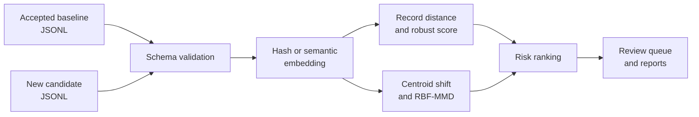

<div align="center">

**정답이 없는 OCR 환경에서 confidence와 embedding signal의 역할을 비교하고, 공개본에서는 embedding drift를 검수 순서로 연결한 프로젝트**


[문제와 목표](#문제와-목표) · [연구 결과](#연구-결과) · [공개 구현](#공개-구현) · [실행](#실행) · [해석 범위](#해석-범위)

</div>

---

## 문제와 목표

새 OCR 문서가 들어온 직후에는 gold transcription이 없어 CER이나 WER을 계산하지 못하는 경우가 많습니다. 라벨을 기다리면 새로운 양식, 언어, 촬영 조건과 손상 패턴을 늦게 발견하고, 모든 문서를 사람이 먼저 확인하는 방식은 처리량이 늘수록 유지하기 어렵습니다.

이 프로젝트는 OCR 오류를 자동 판정하지 않습니다. 승인된 baseline과 새 candidate의 confidence와 embedding signal을 비교해 제한된 검수 시간을 어디에 먼저 쓸지 정합니다. Gold transcription은 detector 입력이 아니라 연구 결과를 사후 평가할 때만 사용했습니다.

## 연구 결과

원 연구에서는 FUNSD 199개 문서에 9개 조건을 적용한 1,791건과 CORD v2 200개 문서에 6개 조건을 적용한 1,200건을 평가했습니다.

| 대표 조건 | Confidence AUPRC | 비교 조합 | 조합 AUPRC | 해석 |
|---|---:|---|---:|---|
| FUNSD 전체 degradation | 0.8295 | confidence + direction | 0.8454 | Confidence가 이미 강했고 추가 이득은 작았음 |
| CORD alphabetic mismatch | 0.5907 | confidence + kNN5 | 0.6904 | 이 조건에서는 kNN novelty가 보완 신호로 작동 |

Embedding 결합은 모든 조건에서 좋아지지 않았습니다. 문서 전체가 훼손된 경우와 숫자·단어 하나만 바뀐 local critical error는 다른 탐지 문제였습니다. 전체 의미가 유지되면 embedding과 document-level confidence가 정상이어도 중요한 field 하나를 놓칠 수 있습니다.

이 표는 원 연구의 집계 결과입니다. 공개 저장소는 원 corpus와 전체 inference pipeline을 포함하지 않으며, embedding drift를 record·batch risk triage로 연결한 실행 가능한 공개본입니다. 데이터와 조건은 [실험 맥락](docs/EXPERIMENT_CONTEXT.md)에 있습니다.

## 공개 구현



| 설계 | 선택 이유 |
|---|---|
| Confidence를 baseline으로 사용 | OCR model 자체 신호가 이미 강한 오류를 먼저 확인하고 embedding이 실제로 보완하는 조건을 구분했습니다. |
| Record와 batch 분리 | 일부 문서의 이상은 leave-one-out nearest-neighbor distance와 median/MAD score로, 공급처나 양식 전체의 변화는 centroid cosine distance와 RBF-MMD로 봤습니다. |
| 작은 CLI로 공개 | Dashboard보다 input schema, score와 output contract를 먼저 검증했습니다. Deterministic hash backend로 외부 API 없이 실행할 수 있고 sentence-transformers backend로 교체할 수 있습니다. |

CLI는 검수 순서가 담긴 JSONL, batch summary, Markdown report와 실행 조건을 추적하는 run hash를 생성합니다.

## 실행

```powershell
python -m venv .venv
.\.venv\Scripts\Activate.ps1
python -m pip install -e ".[dev]"

ocr-embedding-monitor `
  --baseline examples/baseline.jsonl `
  --candidate examples/candidate_corrupted.jsonl `
  --output-dir outputs/demo `
  --backend hash

pytest
```

`hash` backend와 synthetic example은 실행 경로를 확인하기 위한 demo입니다. 실제 OCR corpus의 error detection 성능을 뜻하지 않습니다.

## 해석 범위

- domain shift가 품질 저하를 의미하지는 않습니다.
- 실제 alert threshold는 검수 결과와 업무 비용으로 보정해야 합니다.
- 정상적인 새 문서 유형은 승인 후 baseline을 갱신해야 합니다.
- 숫자나 핵심 단어 하나만 틀린 local error는 document-level embedding으로 놓칠 수 있습니다.
- embedding distance만으로 개인정보나 안전 관련 결정을 자동화해서는 안 됩니다.
- 현재 공개 결과는 synthetic fixture로 실행 경로를 검증한 것이며 실제 OCR corpus의 성능을 주장하지 않습니다.

## 기여

정답 없는 운영환경의 failure detection 문제, confidence baseline, embedding novelty 가설, numeric·local error의 위험과 평가 방향을 설계했습니다. Codex를 활용해 inference와 corruption 실험, feature·detector 비교, 집계, 재시작 가능한 실행과 테스트를 반복 수정·검증했습니다. 공개 코드는 synthetic example, deterministic backend, 테스트와 CI로 risk triage 경로를 확인할 수 있게 구성했습니다.

[미구현 운영 확장 계획](docs/LEARNING_ROADMAP.md)
