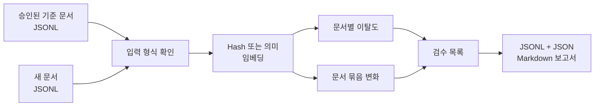

# OCR Failure Risk Monitoring

[English](README.en.md)

정답 전사본이 아직 없는 OCR 처리 환경에서, 사람이 먼저 검수할 문서를 고르는 신호를 비교한 프로젝트입니다. OCR 텍스트를 임베딩으로 바꿔 정상 로그와 비교하면 오류 징후를 찾을 수 있다는 가설에서 시작했습니다.

실험에서는 **confidence가 강한 기본 신호였고, 임베딩은 일부 문자 오류를 보완했습니다.** 금액처럼 그럴듯한 다른 값으로 바뀌는 오류는 놓쳤습니다. 이 결과를 바탕으로 로그로 확인할 수 있는 범위와 별도 검수가 필요한 범위를 나눴습니다.


[활용 상황](#1-왜-정답이-없는-시점에-품질-신호가-필요한가) · [아이디어](#2-아이디어의-출발점-ocr-text도-관측-데이터로-본다) · [평가 설정](#4-평가-설계와-label의-사용-범위) · [결과](#5-검증-결과와-달라진-판단) · [실행](#7-실행-방법)

## 1. 왜 정답이 없는 시점에 품질 신호가 필요한가

OCR의 문자 오류율을 계산하려면 사람이 만든 정답 전사본이 필요합니다. 실제 처리 환경에서는 새 문서가 들어올 때마다 정답을 바로 만들기 어렵고, 모든 문서를 같은 순서로 검수하면 오류 가능성이 큰 문서가 뒤로 밀릴 수 있습니다.

가정한 활용처는 영수증이나 서식 문서를 계속 처리하는 OCR pipeline의 검수 단계입니다. 엔진의 가중치와 문자별 logit에 접근하지 않고, 출력 text와 confidence, 이전에 승인된 정상 로그를 사용할 수 있는 black-box 환경을 다룹니다. 기대하는 효과는 제한된 검수 시간을 위험도가 높은 문서에 먼저 쓰고, 새 batch의 변화가 커지면 표본 검수를 늘리는 것입니다. 실제 검수 시간 절감은 아직 측정하지 않았습니다.

| 조건 | 가정한 상황 |
|---|---|
| Input | 연구에서는 OCR text와 confidence를 비교합니다. 공개 CLI는 text를 입력받습니다. |
| Reference | 이전에 승인된 baseline document를 비교 기준으로 사용할 수 있습니다. |
| Gold label | Monitoring 시점에는 새 batch의 gold transcription이 없습니다. |
| Output | 공개 CLI는 문서별 embedding anomaly와 batch drift를 계산해 검수 목록과 보고서를 만듭니다. |
| Scope | 자동 교정이나 field-level correctness 판정은 구현 범위가 아닙니다. |

## 2. 아이디어의 출발점: OCR text도 관측 데이터로 본다

출발점은 이미지 원본이나 정답 전사본을 바로 확인하기 어렵고, OCR 결과가 text log로 쌓이는 상황이었습니다.

> **OCR text를 embedding vector로 바꿔 정상 batch와 비교하면, vector의 이동 방향과 퍼지는 정도로 이상 징후를 찾을 수 있지 않을까?**

이 질문을 개별 문서와 새 batch, 두 수준으로 나눴습니다.

| 관찰 단위 | 아이디어를 계산으로 옮긴 방법 |
|---|---|
| 개별 문서 | 승인된 정상 문서 중 가장 가까운 이웃과의 cosine distance를 구해, 평소 text와 멀어진 문서를 찾습니다. |
| 새 document batch | Embedding centroid의 방향 변화, MMD와 평균 이웃 거리 비율을 함께 계산해 전체 분포의 이동과 이웃 간격 변화를 봅니다. |

Text만 남는 환경에서도 embedding signal은 계산할 수 있습니다. OCR confidence가 함께 남는다면 두 신호를 비교할 수 있습니다. 실험에서는 confidence가 예상보다 강한 baseline이었고, embedding은 일부 오류와 batch 변화에서만 보완 효과가 있었습니다. 그래서 embedding을 confidence의 대체재가 아니라 text log에서 추가로 얻는 risk signal로 정리했습니다.

## 3. 가설을 어떻게 확인했는가

처음 가설은 embedding 변화가 confidence에서 놓친 OCR 오류를 폭넓게 보완할 것이라는 생각이었습니다. 이를 세 가지 질문으로 나눠 확인했습니다.

| 질문 | 확인 방법 |
|---|---|
| 문서 전체가 흐려지거나 압축되면 어떤 신호가 먼저 움직이는가? | Confidence와 document embedding novelty를 같은 조건에서 비교했습니다. |
| 한두 글자만 바뀌는 오류도 문서 embedding으로 찾을 수 있는가? | 문서 전체 열화와 critical-field omission·substitution을 분리했습니다. |
| 개별 문서의 이상과 batch 전체의 변화는 같은가? | 원 실험에서는 문서 점수와 batch 집계를 비교했고, 공개 CLI에서는 문서별 이탈도와 centroid·MMD 기반 batch drift를 구분했습니다. |

FUNSD 1,791건과 CORD v2 1,200건의 문서·조건 조합에서 평가했습니다. 흐림이나 압축으로 문서 전체가 깨진 경우와, 금액·날짜처럼 일부 문자만 바뀐 경우를 구분했습니다. 후자는 값이 틀려도 문장 전체의 의미가 거의 유지될 수 있기 때문입니다.

## 4. 평가 설계와 label의 사용 범위

| 데이터 | 문서 수 | 조건 수 | 평가 건수 |
|---|---:|---:|---:|
| FUNSD | 199 | 9 | 1,791 |
| CORD v2 | 200 | 6 | 1,200 |

고정된 RapidOCR 설정으로 흐림, 압축, 축소와 대비 변화처럼 문서 전체에 영향을 주는 조건을 만들었습니다. FUNSD는 149개 clean reference와 50개 test document, CORD v2는 100개 train과 100개 test receipt로 나눴습니다. Text embedding은 `BAAI/bge-m3`, clean-reference novelty는 cosine kNN `k=5`로 계산했습니다.

운영 목표는 **새 문서의 정답 없이 점수를 계산하는 runtime label-free monitoring**입니다. 실험에서는 두 설정을 구분했습니다.

- Clean-reference 점수는 정상 로그 분포로 confidence와 embedding novelty를 보정합니다. 오류 label로 학습하지 않습니다.
- Confidence와 embedding 특징을 결합한 logistic regression 비교는 과거 문서의 오류 label로 학습한 진단 실험입니다. 새 test 문서의 정답을 입력하지 않지만, 학습까지 label-free인 방법은 아닙니다.

아래 대표 AUPRC 비교는 두 번째 설정입니다. 실제 오류 문서를 얼마나 앞에 놓는지 평가하기 위해 AUPRC를 주 지표로 쓰고 AUROC와 Recall@5% FPR을 함께 확인했습니다. 신뢰구간은 같은 문서에서 나온 여러 열화 조건을 묶어 resampling하는 document-cluster bootstrap으로 계산했습니다. 세부 설정은 [실험 설명](docs/EXPERIMENT_CONTEXT.md)에 정리했습니다.

## 5. 검증 결과와 달라진 판단

| 대표 조건 | 신뢰도 AUPRC | 함께 사용한 신호 | 결합 AUPRC |
|---|---:|---|---:|
| FUNSD 문서 단위 harmful shift | 0.8295 | 신뢰도 + 임베딩 방향 특징 | 0.8454 |
| CORD 영문자 component 불일치 | 0.5907 | 신뢰도 + kNN5 | 0.6904 |

두 행은 평가 단위와 오류 정의가 다릅니다. FUNSD의 AUPRC 차이 `+0.0159`는 95% CI `[-0.0062, +0.0388]`로 전체 개선을 확정하지 못했습니다. CORD의 `+0.0998`은 영문자 component 오류에서 확인한 보완 효과입니다. 이를 문서 전체 오류 탐지 성능으로 읽으면 안 됩니다. 집계값과 설정은 [결과 자료 안내](results/README.md)에서 확인할 수 있습니다.


원 실험 그림의 가운데는 held-out 문서, 오른쪽은 학습에서 제외한 downsampling 조건입니다. 후자에서는 문서 단위 AUPRC가 `0.9291 → 0.9035`로 낮아졌습니다. 이 비교 역시 과거 오류 label로 학습한 진단 모델의 결과입니다.

임베딩을 더한다고 모든 조건이 좋아지지는 않았습니다. 문서 전체가 훼손된 조건에서는 OCR 신뢰도만으로도 오류 위험을 잘 정렬했습니다. 일부 조건에서는 임베딩을 함께 썼을 때 결과가 좋아졌지만, 금액이나 날짜처럼 국소적인 오류는 두 신호 모두 놓칠 수 있었습니다.

따라서 이 실험에서는 OCR 신뢰도를 먼저 쓰고, 임베딩 이탈도는 특정 오류 유형과 문서 묶음의 변화를 살피는 보조 신호로 두는 편이 맞았습니다. 중요한 필드 한두 개의 오류는 필드 추출과 규칙 검사로 따로 확인해야 합니다.

### 중요한 오류를 나눠 보니 관측 가능한 범위가 달랐습니다

CORD의 `total`·`subtotal` 가격을 critical field로 두고, clean image에서는 맞았지만 열화 뒤 새로 누락되거나 다른 값으로 바뀐 경우를 harmful shift로 정의했습니다. 이 label은 detector 입력이 아니라 평가에만 사용했습니다.

이 보조 진단의 `decomposed risk`는 confidence, coverage와 numeric-output 점수를 정상 분포의 ECDF로 보정해 평균한 값입니다. Coverage는 OCR box와 이미지의 잉크 영역을 비교하므로 text-only 조건을 벗어납니다. 아래 누락 탐지 결과를 embedding 결합의 효과로 해석하지 않았습니다.

| 확인한 질문 | 결과 | 해석 |
|---|---:|---|
| Critical harm 전체 | Confidence AUPRC 0.595 → decomposed risk 0.627 | 평균 gain의 95% CI가 0을 포함해 전체 개선은 확정하지 않았습니다. |
| Critical omission | AUPRC 0.564 → 0.668 | Bootstrap gain `+0.113`, 95% CI `[+0.013, +0.221]`로 누락에는 보완 신호가 있었습니다. |
| Critical substitution | AUPRC 0.136 → 0.110 | 결합 신호가 confidence를 개선하지 못했고 Recall@5% FPR도 0이었습니다. |
| OOD 숫자 치환 | Value-only embedding AUROC 0.972 | 정상 문서 공간에서 벗어난 값은 잘 구분했습니다. |
| 정상 분포 안의 값 교환 | Value-only embedding AUROC 0.415 | 그럴듯한 값끼리 바뀌면 embedding distance로 구분하지 못했습니다. |

임베딩은 정상 범위를 벗어난 값에는 반응했지만, 그럴듯한 값끼리 바뀌면 구분하지 못했습니다. 누락에는 confidence·coverage·numeric-output 보조 진단에서 보완 신호가 있었습니다. 이 차이를 바탕으로 confidence를 기본 검수 신호로 두고, text embedding은 문자 패턴의 이상을 살피는 데 사용하도록 범위를 정했습니다. 금액처럼 중요한 필드는 규칙 검사나 표본 검수를 따로 붙여야 합니다.

숫자 치환 두 행은 실제 OCR 추론 오류를 모은 benchmark가 아니라, 정상 인식한 98개 중요 값의 text를 바꾼 counterfactual 실험입니다. 정상적인 값의 범위에서 벗어났는지와 정답인지가 서로 다른 문제임을 확인하기 위한 비교입니다.

Critical-field 수치와 신뢰구간은 [critical_field_summary.csv](results/critical_field_summary.csv)에 따로 남겼습니다.

## 6. 직접 실행할 수 있는 것: review queue CLI

승인된 기준 문서와 새 문서를 비교해 검수 목록을 만드는 작은 CLI를 제공합니다. 원 corpus, OCR 추론 결과와 대용량 실험 중간 산출물은 공개하지 않았습니다. CLI는 연구 아이디어를 운영 입력 형식으로 단순화한 실행 예시입니다.

CLI에는 text embedding 기반 경로를 구현했습니다. `text`와 식별자가 있는 JSONL을 입력받아 가까운 정상 문서, 이탈 점수와 검수 권고를 반환합니다. Confidence 결합 모델이나 field coverage 검사는 이 CLI에 포함하지 않았습니다. 입력에 confidence가 있더라도 추가 정보로 보존할 뿐 점수에는 사용하지 않습니다.

Synthetic JSONL과 deterministic hash backend로 외부 모델 없이 입력부터 보고서까지 확인할 수 있습니다. 의미 기반 embedding은 선택적으로 연결합니다.


```mermaid
flowchart LR
    A["승인된 기준 문서<br/>JSONL"] --> V["입력 형식 확인"]
    B["새 문서<br/>JSONL"] --> V
    V --> E["Hash 또는 의미<br/>임베딩"]
    E --> R["문서별 이탈도"]
    E --> G["문서 묶음 변화"]
    R --> Q["검수 목록"]
    G --> Q
    Q --> O["JSONL + JSON<br/>Markdown 보고서"]
```

위 AUPRC 결과는 원 실험의 검증된 집계값입니다. CLI는 임베딩 변화 계산과 검수 목록 생성 과정을 빠르게 확인하는 용도이며, 같은 성능 수치를 재현하는 benchmark runner는 아닙니다.

```text
src/ocr_embedding_monitor/   입력 검사, 임베딩, 이탈도와 보고서 생성
examples/                    승인 문서와 새 문서 JSONL 예제
tests/                       입력, 탐지기와 전체 실행 테스트
docs/                        원 실험의 범위와 후속 운영 계획
results/                     README에 사용한 검증 집계 CSV
outputs/                     실행할 때 생성되는 검수 목록과 보고서
```

## 7. 실행 방법

```powershell
python -m venv .venv
.\.venv\Scripts\Activate.ps1
python -m pip install -e ".[dev]"
ocr-embedding-monitor --baseline examples/baseline.jsonl --candidate examples/candidate_corrupted.jsonl --output-dir outputs/demo --backend hash
pytest
```

실행 후 `outputs/demo/`에서 다음 파일을 확인할 수 있습니다.

- `report.md`: 우선 검수할 record의 ID·점수와 가장 가까운 기준 record의 ID
- `scored_records.jsonl`: 원 입력과 문서별 점수·검수 권고
- `summary.json`: centroid distance, MMD, 이웃 거리 비율과 실행 조건

Hash 방식은 문자 패턴을 비교하는 실행 예제입니다. 문장의 의미를 비교하려면 아래 선택 의존성을 설치합니다. 첫 실행에서는 `BAAI/bge-m3` 모델을 내려받습니다.

```powershell
python -m pip install -e ".[semantic]"
ocr-embedding-monitor --baseline examples/baseline.jsonl --candidate examples/candidate_corrupted.jsonl --output-dir outputs/semantic --backend sentence-transformers --device cpu
```

원 실험의 데이터와 조건은 [EXPERIMENT_CONTEXT.md](docs/EXPERIMENT_CONTEXT.md), 필드 단위 탐지와 운영 확장 항목은 [LEARNING_ROADMAP.md](docs/LEARNING_ROADMAP.md)에 정리했습니다.

## 8. 해석 범위와 한계

- 결과는 FUNSD와 CORD v2에 인위적인 열화와 문자 오류를 적용한 조건에서 확인했습니다.
- 문서 분포가 달라졌다고 해서 OCR 오류가 생겼다고 단정할 수는 없습니다.
- 실제 경보 기준은 검수 결과와 업무 비용에 맞춰 다시 정해야 합니다.
- 숫자나 날짜처럼 중요한 필드의 오류를 찾으려면 문서 단위 임베딩과 별도의 필드 검사가 필요합니다.
- 공개 CLI의 합성 예제는 실행 경로를 확인하기 위한 것이며 위 AUPRC 결과를 재현하지 않습니다.
